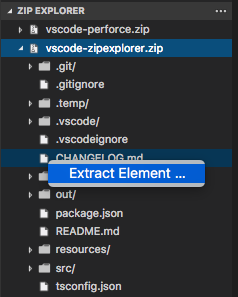

# Zip Explorer

Display the content of a Zip/EPUB/LPF file in a Tree Explorer

## Install

> You can manually install a VS Code extension packaged in a `.vsix` file. Using the Install from VSIX… command in the Extensions view command drop-down, or the Extensions: Install from VSIX… command in the Command Palette, point to the `.vsix` file.

[See VS Code docs for further details](https://code.visualstudio.com/docs/editor/extension-gallery#_install-from-a-vsix).

## Package

Make sure you have Node.js installed. 

If you don’t have `vsce` already installed, then run:

```
npm install -g vsce
```

`vsce` is the command line tool you'll use to publish extensions for VS Code.

Finally run:

```
vsce package
```

from the root of the directory. This will package your extension into a `.vsix` file.

[See VS Code docs for further details](https://code.visualstudio.com/docs/extensions/publish-extension).

## Features

### Explore


1. Right-click on a file with a `.zip`, `.epub`, or `.lpf` extension and select `Explore Zip File`
2. Browse the content of the Zip file in the `Zip Explorer` section
3. Click on a file node to display its content

### Extract


1. Right-click on an element in the `Zip Explorer`
2. Select `Extract Element`
3. Specify the path where to extract

## Requirements

Visual Studio Code v1.13.0

## Credits

* [Visual Studio Code](https://code.visualstudio.com/)
* [vscode-docs on GitHub](https://github.com/Microsoft/vscode-docs)
* [ADM-ZIP for NodeJS](https://github.com/cthackers/adm-zip)
* [Lodash](https://github.com/lodash/lodash)

## License

[MIT](LICENSE.md)
