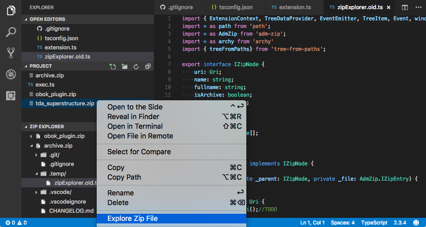

# Zip Explorer

Display the content of a Zip file in a Tree Explorer

## Features

1. Right-click on a file with a `.zip` extension and select `Explore Zip File`
2. Browse the content of the Zip file in the `Zip Explorer` section
3. Click on a file node to display its content

## Requirements

Visual Studio Code v1.13.0

## Credits

* [Visual Studio Code](https://code.visualstudio.com/)
* [vscode-docs on GitHub](https://github.com/Microsoft/vscode-docs)
* [ADM-ZIP for NodeJS](https://github.com/cthackers/adm-zip)
* [Lodash](https://github.com/lodash/lodash)

## License

[MIT](LICENSE.md)
